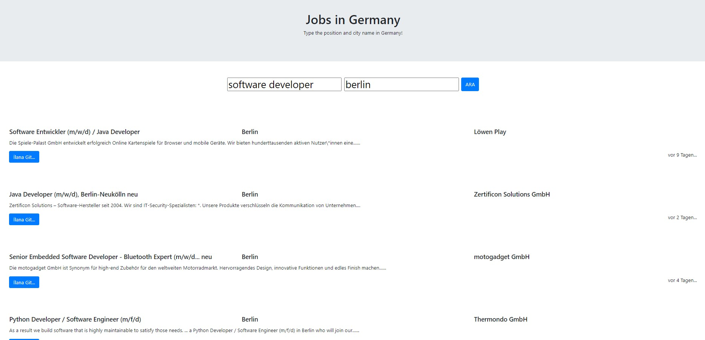

## FrontEnd
- Can found under client folder.
- Very simple UI developed with HTML, CSS and Vanilla JS 

## BackEnd

- Server: Express.js
- Web Scraping: Puppeteer 
- Data is scraped from de.indeed.com

## Requirements

* Node 8
* Git


## Setup

Clone the repo and install the dependencies.

## Steps to run on your local

1) To start the express server, run the following

```bash
cd server
npm run dev
```
2) Open [http://localhost:5000](http://localhost:3000) and seach for the job
3) Enter the job name and city in Germany and see the results


## Issues
Currently only first page of the indeed seach results are scraped, as I get unexpected popups on the next page.
Fell free to develop more.




